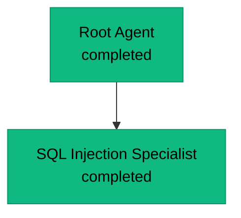

# Agent Graph Persistence

## Overview

Strix now automatically captures and saves the agent execution graph in multiple formats when a scan completes. This provides valuable insights into how agents collaborated, delegated tasks, and communicated during the security assessment.

## What Gets Saved

After each scan, the agent graph is saved in the `agent_runs/<run-name>/` directory in four formats:

### 1. **agent_graph.json** - Raw Graph Data
Complete JSON representation of the agent graph structure including:
- All agent nodes with metadata (id, name, task, status, timestamps)
- All edges (delegation relationships and inter-agent messages)
- Full state snapshots of each agent

**Use case**: Programmatic analysis, custom visualizations, debugging

```json
{
  "nodes": {
    "agent_abc123": {
      "id": "agent_abc123",
      "name": "Root Agent",
      "task": "Comprehensive security scan of target.com",
      "status": "completed",
      "parent_id": null,
      "created_at": "2025-11-12T10:30:00Z",
      "finished_at": "2025-11-12T11:45:00Z"
    }
  },
  "edges": [
    {
      "from": "agent_abc123",
      "to": "agent_def456",
      "type": "delegation",
      "created_at": "2025-11-12T10:32:00Z"
    }
  ]
}
```

### 2. **agent_graph.mmd** - Mermaid Diagram
Standalone Mermaid diagram file that can be rendered in:
- GitHub/GitLab markdown viewers
- Mermaid Live Editor (https://mermaid.live)
- VS Code with Mermaid extensions
- Documentation platforms that support Mermaid

**Use case**: Quick visual inspection, documentation, presentations



### 3. **agent_graph.md** - Human-Readable Report
Markdown document combining:
- Visual Mermaid diagram
- Tree-structured text representation with emojis
- Summary statistics (agent counts by status, edge types)

**Use case**: Reports, documentation, human review

Example output:
```
# Agent Execution Graph

## Visual Diagram
[Mermaid diagram here]

# Agent Graph Structure

🟢 **Root Agent** (agent_abc123)
   Status: completed
   Task: Comprehensive security scan...

  └─ ✅ **SQL Injection Specialist** (agent_def456)
     Status: completed
     Task: Test all input fields for SQL injection...
     Completed: 2025-11-12T11:20:00Z

---

## Summary Statistics
- **Total Agents**: 5
- **Completed**: 4
- **Failed**: 1
- **Total Edges**: 8
  - Delegation: 4
  - Messages: 4
```

### 4. **agent_nodes.json** - Detailed Node Information
Comprehensive JSON with all agent node details including:
- Full state dumps
- Tool execution history
- Results and findings
- Timestamps and metadata

**Use case**: Detailed analysis, post-scan investigation, debugging

## Visual Features

The generated diagrams use color coding to represent agent status:

- 🟢 **Green** - Running agents (in progress)
- 🟡 **Yellow** - Waiting agents (paused for messages)
- ✅ **Green (completed)** - Successfully completed agents
- ❌ **Red** - Failed agents
- ⏹️ **Gray** - Stopped agents (user-terminated)

## Graph Structure

### Nodes (Agents)
Each node represents an agent with:
- **Unique ID**: Auto-generated identifier
- **Name**: Human-readable agent name
- **Task**: Specific mission assigned to the agent
- **Status**: Current execution state
- **Parent ID**: Reference to parent agent (if subagent)
- **Timestamps**: Creation and completion times
- **Results**: Final outcomes and findings

### Edges (Relationships)

#### Delegation Edges (Solid Lines `-->`)
Represent parent-child relationships when agents spawn subagents:
```
Root Agent --> SQL Specialist
```

#### Message Edges (Dotted Lines `-.->`)
Represent inter-agent communication:
```
XSS Specialist -.information.-> Auth Specialist
```

## Viewing the Graphs

### Method 1: GitHub/GitLab
Simply open `agent_graph.md` in any GitHub/GitLab repository - the Mermaid diagram will render automatically.

### Method 2: Mermaid Live Editor
1. Open https://mermaid.live
2. Copy contents of `agent_graph.mmd`
3. Paste into the editor for interactive viewing

### Method 3: VS Code
1. Install "Markdown Preview Mermaid Support" extension
2. Open `agent_graph.md`
3. Use Markdown preview (Cmd/Ctrl + Shift + V)

### Method 4: Programmatic Analysis
```python
import json

# Load the raw graph data
with open("agent_runs/my-scan/agent_graph.json") as f:
    graph = json.load(f)

# Analyze agent relationships
for agent_id, node in graph["nodes"].items():
    print(f"{node['name']}: {node['status']}")
    
# Count delegation depth
delegation_edges = [e for e in graph["edges"] if e["type"] == "delegation"]
print(f"Total subagents created: {len(delegation_edges)}")
```

## Use Cases

### 1. Understanding Agent Collaboration
See how the main agent delegated specialized tasks to subagents and how they communicated.

### 2. Debugging Complex Scans
Identify which agents failed, what they were working on, and trace the execution flow.

### 3. Performance Analysis
Measure:
- Agent creation patterns
- Task distribution efficiency
- Completion rates by agent type

### 4. Documentation and Reporting
Include the agent graph in security reports to show:
- Comprehensive testing coverage
- Specialized expertise applied
- Systematic approach to security assessment

### 5. Training and Education
Use captured graphs to:
- Teach multi-agent security testing
- Demonstrate delegation strategies
- Show real-world pentesting workflows

## Location

All agent graph files are saved to:
```
agent_runs/
  <run-name>/
    ├── agent_graph.json       # Raw data
    ├── agent_graph.mmd        # Mermaid diagram
    ├── agent_graph.md         # Human-readable report
    ├── agent_nodes.json       # Detailed node info
    ├── scan_report.md         # Security findings
    └── vulnerabilities/       # Vulnerability reports
        ├── vuln-0001.md
        └── ...
```

## Technical Details

### Implementation
- Agent graph is maintained in-memory during scan execution
- Graph is persisted when `Tracer.save_run_data()` is called
- No performance impact during scan (save happens at cleanup)
- Import errors handled gracefully (logs warning if graph unavailable)

### Data Structure
```python
_agent_graph = {
    "nodes": {
        "agent_id": {
            "id": str,
            "name": str,
            "task": str,
            "status": str,  # running|waiting|completed|failed|stopped
            "parent_id": str | None,
            "created_at": str,
            "finished_at": str | None,
            "result": dict | None,
            "state": dict  # Full AgentState dump
        }
    },
    "edges": [
        {
            "from": str,
            "to": str,
            "type": str,  # delegation|message
            "message_type": str | None,  # query|instruction|information
            "priority": str | None,
            "created_at": str
        }
    ]
}
```

## Future Enhancements

Potential future additions:
- Interactive HTML graph viewer with zoom/pan
- Real-time graph streaming during scan
- Graph diff tool to compare multiple scan runs
- Performance metrics overlay (execution time, tool usage)
- Export to GraphViz DOT format
- Integration with graph analysis libraries (NetworkX)

## Troubleshooting

**Q: Graph files are not being generated**
- Check that agents were actually created during the scan
- Look for import errors in logs
- Ensure `agent_runs/` directory has write permissions

**Q: Mermaid diagram not rendering**
- Some platforms have size limits for Mermaid diagrams
- Try opening the `.mmd` file directly in Mermaid Live Editor
- For very large graphs, use the JSON format for custom visualization

**Q: How do I know if agents were created?**
- Check the Strix CLI during execution - you should see agents in the tree view
- Look for log messages mentioning agent creation
- Open `agent_nodes.json` to see the raw count

## Related Documentation

- [Multi-Agent System Architecture](./strix/tools/agents_graph/README.md)
- [Tracer and Runtime Logging](./strix/cli/README.md)
- [Agent State Management](./strix/agents/README.md)

